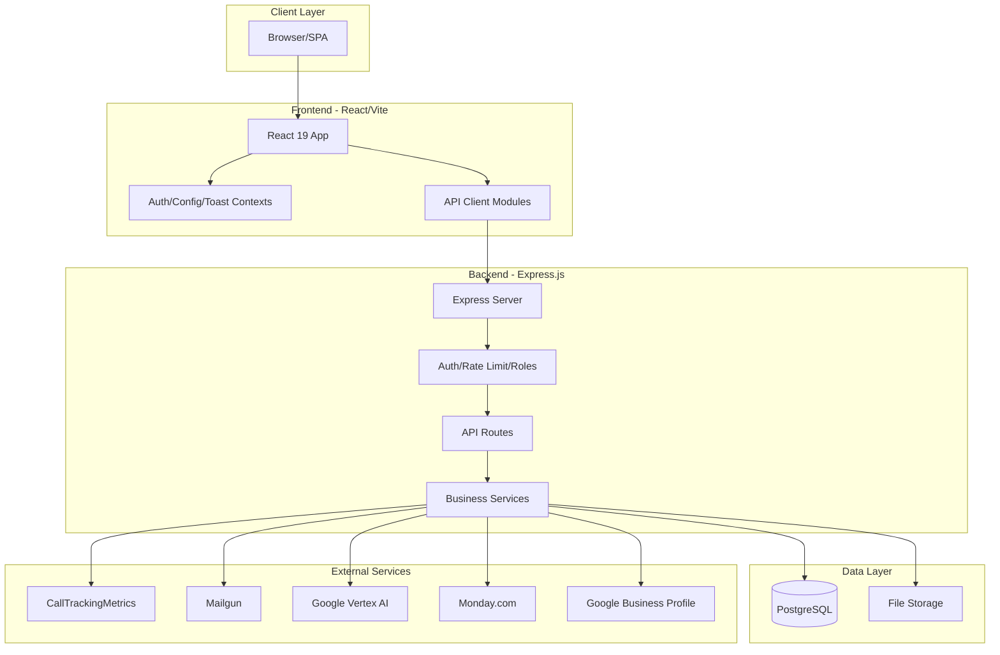
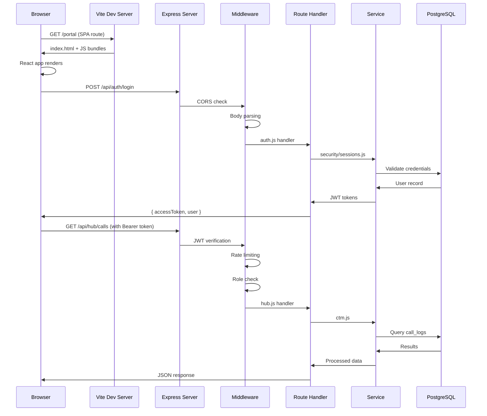
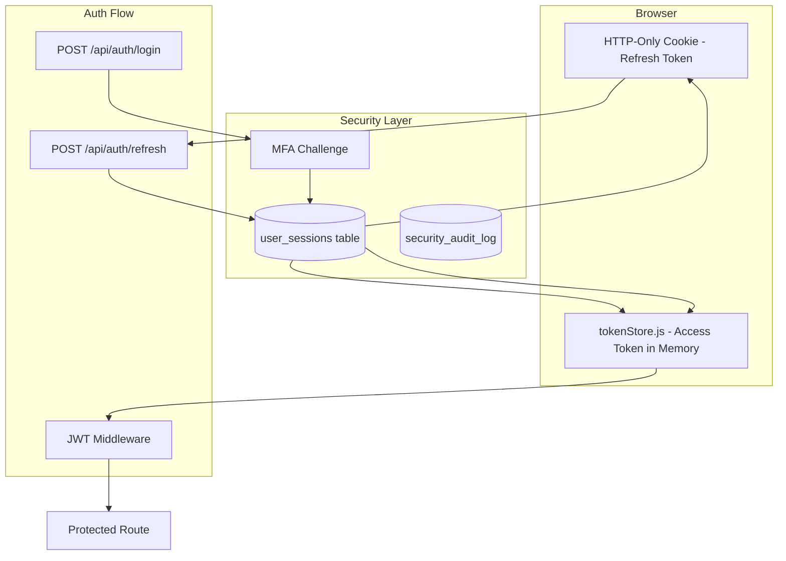
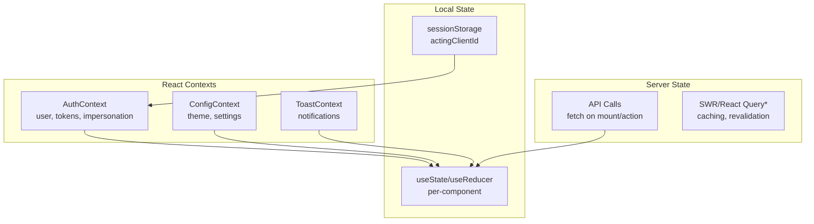
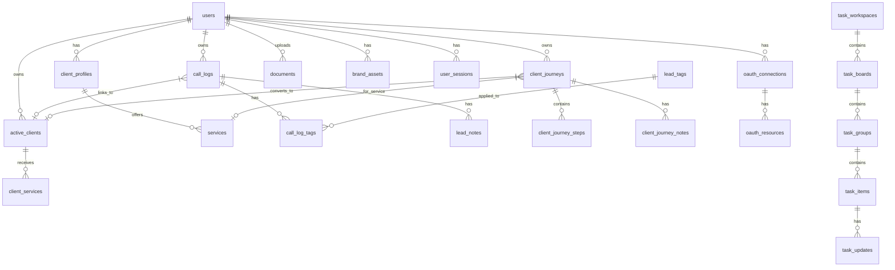
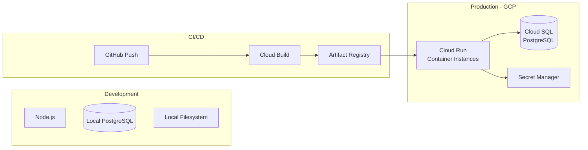
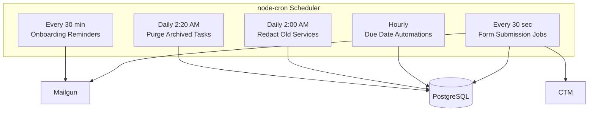
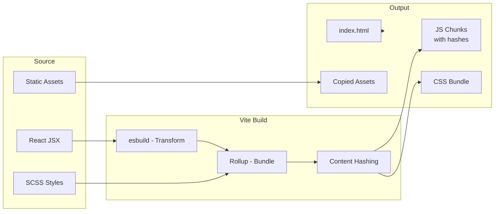

# System Architecture

> **MAINTENANCE DIRECTIVE**: Update this file when:
> - New service files are added to `server/services/`
> - New route files are added to `server/routes/`
> - Frontend folder structure changes in `src/`
> - Middleware chain is modified
> - Database architecture changes (new table relationships)
> - Deployment architecture changes
> - New scheduled jobs are added

This document describes the overall architecture of the Anchor Client Dashboard application.

---

## High-Level Architecture



---

## Folder Structure

### Root Level

```
Anchor-Client-Dashboard/
├── server/          # Express.js backend (Node.js)
├── src/             # React frontend (Vite)
├── uploads/         # User uploads (local dev only)
├── dist/            # Production build output
├── docs/            # Documentation
├── node_modules/    # Dependencies
├── Dockerfile       # Production container definition
├── cloudbuild.yaml  # CI/CD pipeline
├── vite.config.mjs  # Vite configuration
├── package.json     # Dependencies and scripts
├── yarn.lock        # Dependency lockfile
├── .env             # Environment variables (not committed)
├── .env.public      # Public env vars (committed)
└── SKILLS.md        # Capabilities reference
```

### Server Directory (`server/`)

```
server/
├── index.js              # Entry point, middleware setup, cron jobs
├── auth.js               # Authentication endpoints (/api/auth/*)
├── db.js                 # PostgreSQL connection pool
├── loadEnv.js            # Environment loading
│
├── middleware/
│   ├── auth.js           # JWT verification, user attachment
│   ├── rateLimit.js      # Request rate limiting
│   └── roles.js          # Role-based access control
│
├── routes/
│   ├── hub.js            # Main CRM endpoints (/api/hub/*)
│   ├── onboarding.js     # Client onboarding (/api/onboarding/*)
│   ├── tasks.js          # Task management (/api/tasks/*)
│   ├── forms.js          # Form builder (/api/forms/*)
│   ├── formsPublic.js    # Public form endpoints (/embed/*)
│   ├── reviews.js        # Review management (/api/reviews/*)
│   └── webhooks.js       # Webhook handlers (/api/webhooks/*)
│
├── services/
│   ├── ai.js             # Vertex AI content generation
│   ├── ctm.js            # CallTrackingMetrics integration
│   ├── mailgun.js        # Email sending and logging
│   ├── monday.js         # Monday.com sync
│   ├── imagen.js         # Vertex Imagen image generation
│   ├── reviews.js        # Google Business Profile reviews
│   ├── notifications.js  # In-app notifications
│   ├── emailTemplate.js  # Email HTML templates
│   ├── formAI.js         # Form AI processing
│   ├── formPDF.js        # Form PDF generation
│   ├── formSubmissionJobs.js  # Form submission queue
│   ├── onboardingPdf.js  # Onboarding PDF generation
│   ├── onboardingReminders.js # Expiry reminders
│   ├── taskAutomations.js     # Task automation engine
│   ├── taskCleanup.js    # Archived task purging
│   ├── oauthIntegration.js    # OAuth token management
│   └── security/         # Security infrastructure
│       ├── index.js      # Security module exports
│       ├── audit.js      # Security audit logging
│       ├── deviceFingerprint.js # Device tracking
│       ├── mfa.js        # Multi-factor authentication
│       ├── oauth.js      # OAuth login (Google/Microsoft)
│       ├── passwordPolicy.js   # Password validation
│       ├── rateLimit.js  # Auth rate limiting
│       ├── sessions.js   # Session management
│       └── tokens.js     # JWT token handling
│
├── sql/
│   ├── init.sql          # Main database schema
│   ├── migrate_security.sql   # Security tables
│   ├── migrate_forms_platform.sql # Forms schema
│   ├── migrate_reviews.sql    # Reviews schema
│   └── migrate_*.sql     # Other migrations
│
└── utils/
    └── roles.js          # Role hierarchy utilities
```

### Frontend Directory (`src/`)

```
src/
├── index.jsx             # React entry point
├── App.jsx               # Root component with providers
├── config.js             # Frontend configuration
│
├── api/                  # API client modules
│   ├── client.js         # Axios instance with interceptors
│   ├── tokenStore.js     # Access token management
│   ├── auth.js           # Auth endpoints
│   ├── calls.js          # Lead/call endpoints
│   ├── journeys.js       # Journey endpoints
│   ├── clients.js        # Client management
│   ├── profile.js        # User profile
│   ├── brand.js          # Brand assets
│   ├── documents.js      # Document management
│   ├── forms.js          # Form builder
│   ├── tasks.js          # Task management
│   ├── reviews.js        # Review management
│   ├── emailLogs.js      # Email logs
│   ├── oauth.js          # OAuth connections
│   └── ...
│
├── assets/
│   ├── images/           # Static images, icons
│   └── scss/             # Global styles, theme variables
│
├── constants/
│   └── clientPresets.js  # Client type configurations
│
├── contexts/
│   ├── AuthContext.jsx   # Authentication state
│   ├── ConfigContext.jsx # App configuration
│   └── ToastContext.jsx  # Toast notifications
│
├── hooks/
│   ├── useAuth.js        # Auth context hook
│   ├── useConfig.js      # Config context hook
│   └── ...
│
├── layout/
│   ├── MainLayout/       # Authenticated layout
│   │   ├── index.jsx     # Layout wrapper
│   │   ├── Header/       # Top navigation bar
│   │   ├── Sidebar/      # Left navigation
│   │   ├── MenuList/     # Navigation menu items
│   │   └── LogoSection/  # Logo component
│   ├── MinimalLayout/    # Unauthenticated layout
│   └── NavigationScroll.jsx
│
├── menu-items/           # Navigation menu definitions
│   ├── index.js          # Menu aggregator
│   ├── portal.js         # Client portal menu
│   ├── clientHub.js      # Admin hub menu
│   ├── tasks.js          # Tasks menu
│   └── forms.js          # Forms menu
│
├── routes/
│   ├── index.jsx         # Route configuration
│   ├── MainRoutes.jsx    # Authenticated routes
│   ├── AuthenticationRoutes.jsx # Auth routes
│   ├── RequireAuth.jsx   # Auth guard
│   ├── ErrorBoundary.jsx # Error handling
│   └── paths.js          # Route path constants
│
├── themes/
│   ├── index.jsx         # MUI theme provider
│   ├── palette.jsx       # Color palette
│   ├── typography.jsx    # Typography settings
│   └── overrides/        # Component overrides
│
├── ui-component/
│   ├── Loader.jsx        # Loading spinner
│   ├── Loadable.jsx      # Lazy loading wrapper
│   ├── Logo.jsx          # Logo component
│   ├── FireworksCanvas.jsx # Celebration animation
│   ├── cards/            # Card components
│   └── extended/         # Extended MUI components
│
├── utils/
│   ├── errors.js         # Error handling utilities
│   ├── colorUtils.js     # Color manipulation
│   └── password-strength.js # Password validation
│
└── views/                # Page components
    ├── admin/            # Admin-only views
    │   ├── AdminHub.jsx  # Client/admin management
    │   ├── ClientView.jsx # Client view mode
    │   ├── ProfileSettings.jsx
    │   ├── ServicesManagement.jsx
    │   ├── ActiveClients.jsx
    │   └── SharedDocuments.jsx
    │
    ├── client/           # Client portal views
    │   ├── ClientPortal.jsx # Main client dashboard
    │   ├── BlogEditor.jsx   # Blog management
    │   └── ReviewsPanel.jsx # Review responses
    │
    ├── forms/
    │   └── FormsManager.jsx # Form builder
    │
    ├── tasks/
    │   ├── TaskManager.jsx  # Task board
    │   ├── components/      # Task components
    │   └── panes/           # Task detail panes
    │
    └── pages/
        ├── auth-forms/      # Login/register forms
        ├── authentication/  # Auth pages
        └── onboarding/      # Client onboarding wizard
```

---

## Request Lifecycle



---

## Authentication Architecture



**Key Points:**
- Access tokens are short-lived (15 min) and stored in memory
- Refresh tokens are HTTP-only cookies (30-day sliding window)
- Sessions have absolute expiry (90 days)
- MFA is triggered for new devices, new IPs, or after inactivity
- All auth events are logged to `security_audit_log`

---

## State Management

### Frontend State



**Pattern:**
- Global state in Contexts (auth, config, toasts)
- Server state fetched via API calls, stored locally in components
- `actingClientId` in sessionStorage for admin "view as client" mode
- No Redux - uses React Context + local state

**CRITICAL - Immediate UI Feedback:**
All state-changing actions (button clicks, form submissions, toggles, activations, deletions, etc.) must immediately update the UI to reflect the change. Do not wait for a full refetch. Use server-returned data to update local state optimistically. This pattern:
- Prevents users from triggering duplicate actions
- Provides clear confirmation that actions succeeded
- Ensures the UI always reflects the current state

Example: When activating a client, use the `client` object returned by the API to update `setClients()` immediately, rather than requiring a page refresh.

### Backend State

- **Stateless API**: No in-memory session state
- **Database**: PostgreSQL is the source of truth
- **Sessions**: Tracked in `user_sessions` table
- **File uploads**: Local filesystem (dev) or ephemeral (Cloud Run)
- **Binary data**: Stored in PostgreSQL (avatars, some assets)

---

## Database Architecture



**Core Tables:**
- `users` - All user accounts (clients, admins, team)
- `client_profiles` - Extended client configuration
- `call_logs` - Lead/call records from CTM
- `client_journeys` - Journey tracking for leads
- `active_clients` - Converted customers
- `user_sessions` - Active login sessions

See [SKILLS.md](../SKILLS.md) for complete schema documentation.

---

## Deployment Architecture



**Production Characteristics:**
- **Stateless containers**: No persistent local storage
- **Horizontal scaling**: 1-3 instances (configurable)
- **Database**: Cloud SQL with connection pooling
- **Secrets**: Loaded from Secret Manager via environment
- **No persistent uploads**: Must use database or Cloud Storage

---

## API Architecture

### Route Organization

| Router | Mount Path | Purpose |
|--------|------------|---------|
| `auth.js` | `/api/auth` | Authentication (login, logout, register, MFA) |
| `hub.js` | `/api/hub` | Main CRM operations (clients, calls, journeys) |
| `onboarding.js` | `/api/onboarding` | Client onboarding wizard |
| `tasks.js` | `/api/tasks` | Task management system |
| `forms.js` | `/api/forms` | Form builder (protected) |
| `formsPublic.js` | `/embed` | Public form embeds |
| `reviews.js` | `/api/reviews` | Review management |
| `webhooks.js` | `/api/webhooks` | External webhooks (Mailgun) |

### Middleware Chain

```
Request
  ↓
CORS (cors)
  ↓
Body Parser (express.json)
  ↓
Cookie Parser
  ↓
Helmet (Security Headers)
  ↓
JWT Verification (if /api/*)
  ↓
Rate Limiting
  ↓
Role Check
  ↓
Route Handler
  ↓
Response
```

### Error Handling

```javascript
// Errors bubble up to global handler in server/index.js
app.use((err, req, res, _next) => {
  console.error('[server-error]', err);
  const message = NODE_ENV === 'production' 
    ? 'Unexpected server error' 
    : err.message;
  res.status(500).json({ message });
});
```

---

## Scheduled Jobs



Jobs are defined in `server/index.js` using `node-cron`.

---

## Security Layers

1. **Transport**: HTTPS (enforced in Cloud Run)
2. **Headers**: Helmet sets security headers, CSP
3. **CORS**: Strict origin checking
4. **Authentication**: JWT with refresh token rotation
5. **Authorization**: Role-based access control
6. **Rate Limiting**: IP and user-based limits
7. **Input Validation**: Zod schemas on backend
8. **Audit Logging**: Immutable security event log

See [SECURITY.md](SECURITY.md) for detailed security documentation.

---

## Frontend Build



**Build Command:**
```bash
yarn build  # Outputs to ./dist
```

**Cache Strategy:**
- `index.html`: `no-store` (always fresh)
- `/assets/*`: `max-age=31536000, immutable` (hashed filenames)

---

## Related Documentation

- [SETUP.md](SETUP.md) - Development environment setup
- [DATA_FLOWS.md](DATA_FLOWS.md) - Business workflow documentation
- [API_REFERENCE.md](API_REFERENCE.md) - Complete API documentation
- [SECURITY.md](SECURITY.md) - Security architecture
- [INTEGRATIONS.md](INTEGRATIONS.md) - Third-party integrations
- [SKILLS.md](../SKILLS.md) - Capabilities and database schema

---

*Last updated: January 2026*

