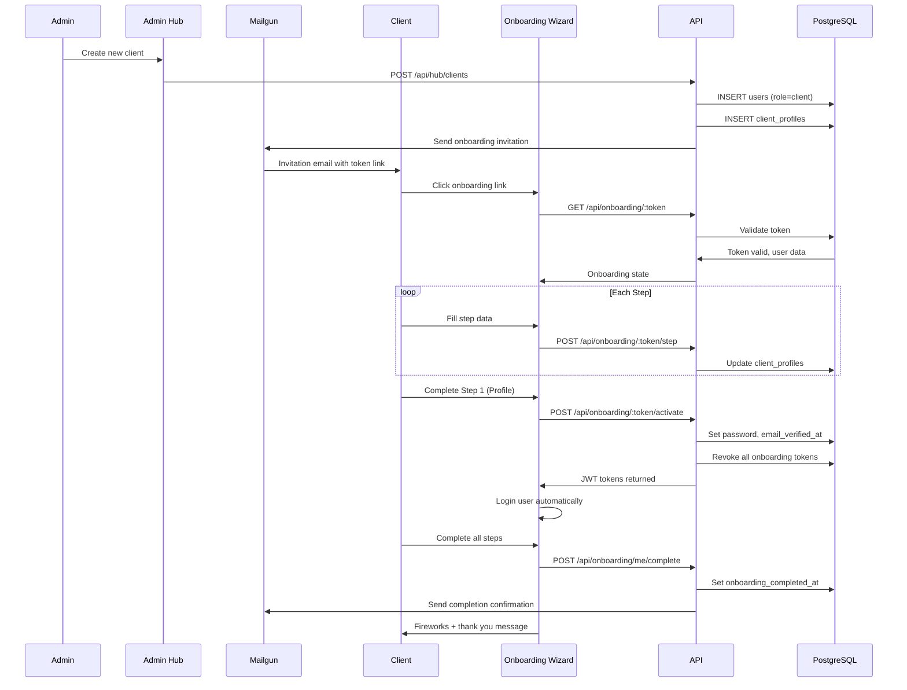

# Business Workflows & Data Flows

> **MAINTENANCE DIRECTIVE**: Update this file when:
> - Business workflow logic changes (onboarding, leads, journeys, tasks)
> - State machines or status transitions are modified
> - New integration data flows are added
> - Email notification triggers change
> - Lead classification categories change
> - Journey or task lifecycle stages change

This document describes the key business processes and data flows in the Anchor Client Dashboard.

---

## Table of Contents

1. [Client Onboarding Flow](#1-client-onboarding-flow)
2. [Authentication Flow](#2-authentication-flow)
3. [Lead Management Flow](#3-lead-management-flow)
4. [Client Journey Flow](#4-client-journey-flow)
5. [Task Management Flow](#5-task-management-flow)
6. [Form Submission Flow](#6-form-submission-flow)
7. [Review Management Flow](#7-review-management-flow)
8. [Email Notification Flow](#8-email-notification-flow)

---

## 1. Client Onboarding Flow

### Overview

New clients are onboarded through a multi-step wizard that collects profile information, credentials, and brand assets. The flow supports "Save and Continue Later" functionality.

### Sequence Diagram

### Onboarding Steps

| Step | Fields Collected | Required |
|------|------------------|----------|
| 1. Profile | Name, email, password, phone, communication prefs | Yes |
| 2. Services | Service selection based on client type | Configurable |
| 3. Brand | Logo, style guides, colors | Configurable |
| 4. Website | Admin credentials, CMS type | Configurable |
| 5. GA4 | Google Analytics 4 access | Configurable |
| 6. Google Ads | Google Ads account access | Configurable |
| 7. Meta | Facebook/Instagram access | Configurable |
| 8. Forms | Form integration details | Configurable |

### Key Database Tables

- `users` - Client user account
- `client_profiles` - Extended profile and step status
- `brand_assets` - Logo, style guides
- `client_onboarding_tokens` - Secure invitation tokens

### Token Lifecycle

1. **Created**: When admin sends invitation
2. **Validated**: On each wizard load
3. **Consumed**: After Step 1 completion (password set)
4. **Revoked**: When new token generated or onboarding complete

---

## 2. Authentication Flow

### Login with MFA

### Token Refresh Flow

### Session Management

| Event | Action |
|-------|--------|
| Login | Create session, issue tokens |
| Token refresh | Rotate refresh token, extend session |
| Logout | Revoke session |
| Password change | Revoke all sessions |
| MFA change | Revoke all sessions |
| 90 days | Absolute session expiry |

---

## 3. Lead Management Flow

### CTM Sync and Classification

### Lead Categories

| Category | Description | Auto-Star Rating |
|----------|-------------|------------------|
| `converted` | Agreed to service (manual only) | ⭐⭐⭐⭐⭐ |
| `warm` | Interested, needs follow-up | ⭐⭐⭐ |
| `very_good` | Ready to book/buy | ⭐⭐⭐⭐ |
| `needs_attention` | Callback requested | ⭐⭐⭐ |
| `voicemail` | Left voicemail | — |
| `unanswered` | No conversation | — |
| `not_a_fit` | Not qualified | ⭐⭐ |
| `spam` | Junk call | ⭐ |
| `neutral` | General inquiry | — |
| `applicant` | Job inquiry | — |
| `unreviewed` | Not yet classified | — |

### Rating Sync (Two-Way)

---

## 4. Client Journey Flow

### Journey Lifecycle

### Creating a Journey

### Journey to Active Client Conversion

### Multi-Journey Support

A single active client can have multiple journeys for different services:

---

## 5. Task Management Flow

### Task Hierarchy

### Task Status Flow

### Monday.com Sync

---

## 6. Form Submission Flow

### Form Embed Lifecycle

### Form Builder Features

| Feature | Description |
|---------|-------------|
| Visual Editor | Monaco-based JSON editor |
| Field Types | Text, email, phone, select, textarea, checkbox, file |
| Conditional Logic | Show/hide fields based on other values |
| Multi-Step | Split form into multiple pages |
| Theming | Custom colors, fonts per embed |
| AI Processing | Classify submissions, extract data |

---

## 7. Review Management Flow

### Review Response Workflow

### Review States

| State | Description |
|-------|-------------|
| `pending` | New review, needs attention |
| `draft` | AI draft generated |
| `approved` | Response ready to send |
| `responded` | Response posted to GBP |
| `flagged` | Needs manual review |

---

## 8. Email Notification Flow

### Email Types

| Type | Trigger | Template |
|------|---------|----------|
| `onboarding_invite` | Admin creates client | Invitation link |
| `onboarding_complete` | Client finishes onboarding | Welcome message |
| `onboarding_reminder` | Token expires soon | Reminder to complete |
| `password_reset` | User requests reset | Reset link |
| `form_submission` | Form submitted | Submission details |
| `rush_job_notification` | Task marked rush | Rush job alert |
| `blog_notification` | Blog published | Blog post link |
| `document_review` | Document uploaded | Review request |

### Email Logging Flow

---

## Data Lifecycle Summary

### Lead → Active Client

### Client Onboarding → Portal Access

---

## Related Documentation

- [ARCHITECTURE.md](ARCHITECTURE.md) - System architecture
- [API_REFERENCE.md](API_REFERENCE.md) - API endpoints
- [SECURITY.md](SECURITY.md) - Authentication details
- [INTEGRATIONS.md](INTEGRATIONS.md) - Third-party services
- [SKILLS.md](../SKILLS.md) - Database schema

---

*Last updated: January 2026*

