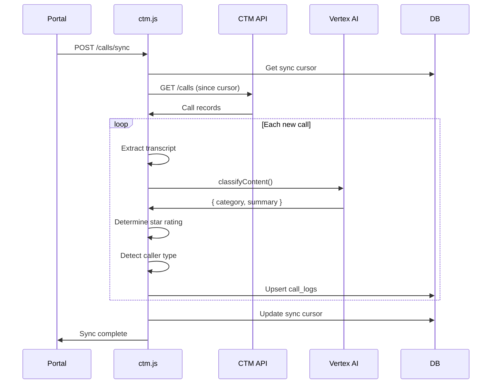
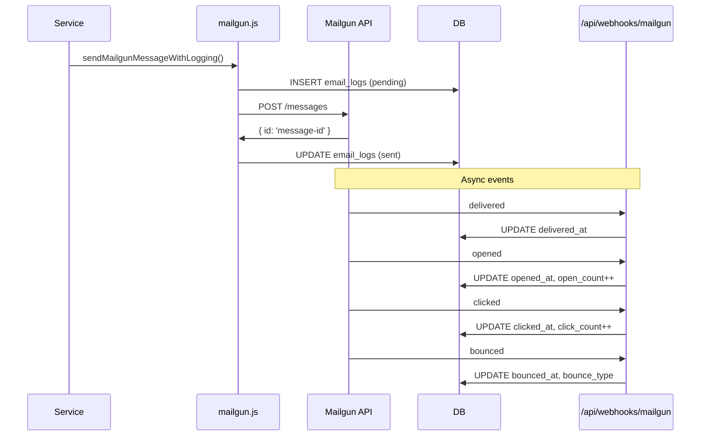
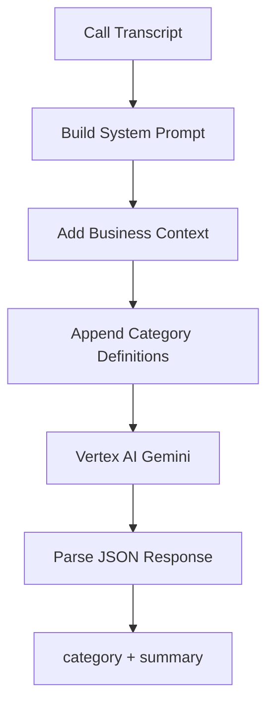
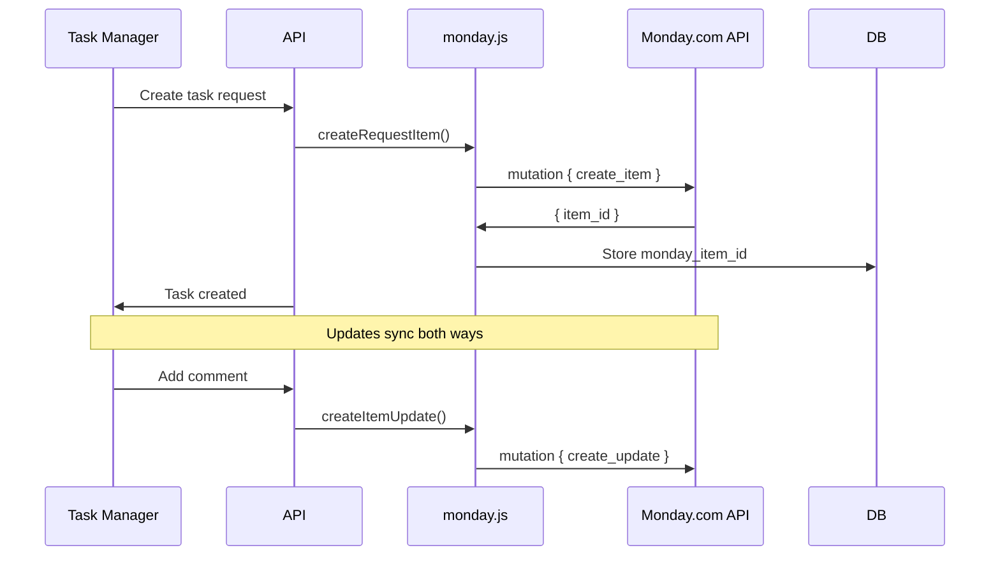
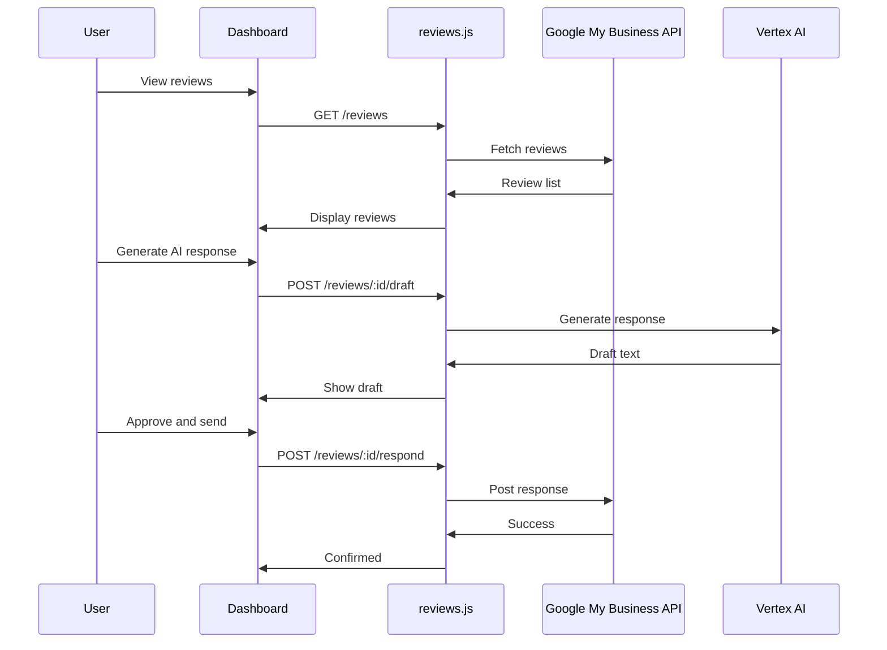
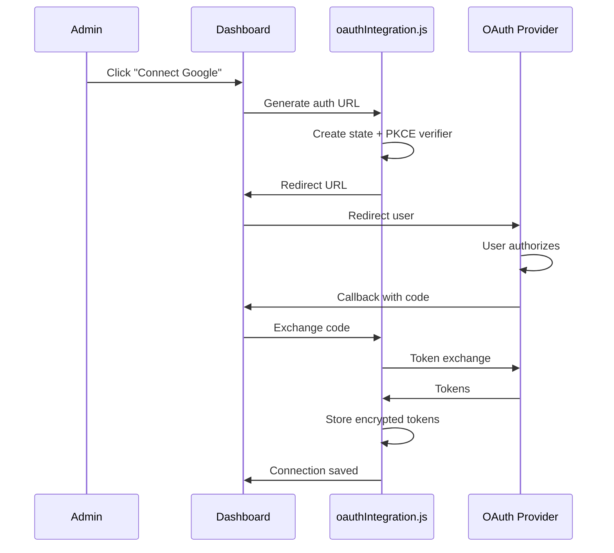

# Third-Party Integrations

This document describes all external service integrations in the Anchor Client Dashboard.

---

## Table of Contents

1. [CallTrackingMetrics (CTM)](#1-calltrackingmetrics-ctm)
2. [Mailgun](#2-mailgun)
3. [Google Vertex AI](#3-google-vertex-ai)
4. [Monday.com](#4-mondaycom)
5. [Google Business Profile](#5-google-business-profile)
6. [Looker](#6-looker)
7. [OAuth Providers](#7-oauth-providers)

---

## 1. CallTrackingMetrics (CTM)

### Overview

CTM provides call tracking, recording, and scoring for leads. The integration syncs call data, transcripts, and ratings.

### Configuration

**Per-client settings in `client_profiles`:**

| Column | Description |
|--------|-------------|
| `ctm_account_number` | CTM account ID |
| `ctm_api_key` | API key |
| `ctm_api_secret` | API secret |
| `ctm_sync_cursor` | Last sync timestamp |
| `ctm_last_page_token` | Pagination state |

### Service Location

`server/services/ctm.js`

### Key Functions

| Function | Purpose |
|----------|---------|
| `fetchCtmCalls(config, sinceTimestamp)` | Fetch calls from CTM API |
| `pullCallsFromCtm(clientId)` | Full sync flow with classification |
| `buildCallsFromCache(clientId)` | Load calls from local database |
| `postSaleToCTM(callId, score)` | Update rating in CTM |
| `classifyContent(prompt, transcript)` | AI classify call content |
| `enrichCallerType(call, clientId)` | Detect repeat/returning callers |

### Sync Flow



### Two-Way Rating Sync

When rating changes in the Dashboard:
1. `POST /api/hub/calls/:id/score` called
2. `postSaleToCTM(callId, score)` updates CTM
3. Local `call_logs.score` updated

When rating exists in CTM:
1. `pullCallsFromCtm()` reads CTM score
2. Score is applied to local record
3. Category recalculated from rating

### Lead Categories

| Category | Auto-Star | Description |
|----------|-----------|-------------|
| `converted` | ⭐⭐⭐⭐⭐ | Manual only - agreed to service |
| `warm` | ⭐⭐⭐ | Interested lead |
| `very_good` | ⭐⭐⭐⭐ | Ready to buy |
| `needs_attention` | ⭐⭐⭐ | Callback requested |
| `not_a_fit` | ⭐⭐ | Not qualified |
| `spam` | ⭐ | Junk call |

### CTM API Reference

```javascript
// Example: Fetch calls
const response = await fetch(
  `https://api.calltrackingmetrics.com/api/v1/accounts/${accountId}/calls`,
  {
    headers: {
      'Authorization': `Basic ${Buffer.from(`${apiKey}:${apiSecret}`).toString('base64')}`
    }
  }
);
```

---

## 2. Mailgun

### Overview

Mailgun handles all outbound email: onboarding invitations, notifications, password resets, and form submissions.

### Configuration

**Environment Variables:**

| Variable | Description |
|----------|-------------|
| `MAILGUN_API_KEY` | API key |
| `MAILGUN_DOMAIN` | Sending domain |
| `MAILGUN_FROM_EMAIL` | From address |
| `MAILGUN_FROM_NAME` | From display name |

### Service Location

`server/services/mailgun.js`

### Key Functions

| Function | Purpose |
|----------|---------|
| `sendMailgunMessage(options)` | Send email (low-level) |
| `sendMailgunMessageWithLogging(options)` | Send with database logging |
| `fetchEmailLogs(filters)` | Get logged emails |
| `getEmailStats()` | 30-day statistics |
| `updateEmailLogTracking(mailgunId, event, data)` | Process webhook events |

### Email Flow



### Email Types

| Type | Trigger |
|------|---------|
| `onboarding_invite` | Admin creates client |
| `onboarding_complete` | Client completes onboarding |
| `onboarding_reminder` | Token expiring soon |
| `password_reset` | User requests reset |
| `form_submission` | Form submitted |
| `rush_job_notification` | Task marked rush |
| `blog_notification` | Blog published |
| `document_review` | Document needs review |

### Webhook Configuration

Set up in Mailgun dashboard:
- URL: `https://your-domain.com/api/webhooks/mailgun`
- Events: `delivered`, `opened`, `clicked`, `bounced`, `complained`, `unsubscribed`

### Email Tracking Fields

| Field | Description |
|-------|-------------|
| `delivered_at` | When delivered |
| `opened_at` | First open |
| `open_count` | Total opens |
| `clicked_at` | First click |
| `click_count` | Total clicks |
| `bounced_at` | Bounce timestamp |
| `bounce_type` | `hard` or `soft` |
| `complained_at` | Spam complaint |
| `unsubscribed_at` | Unsubscribe |
| `delivery_status` | DKIM/DMARC/TLS details |

---

## 3. Google Vertex AI

### Overview

Vertex AI powers:
- Call transcript classification
- Blog content generation
- Form submission processing
- Review response drafting
- AI task summaries

### Configuration

**Environment Variables:**

| Variable | Description |
|----------|-------------|
| `GOOGLE_APPLICATION_CREDENTIALS` | Service account key path |
| `GCP_PROJECT_ID` | Google Cloud project |
| `VERTEX_LOCATION` | Region (e.g., `us-central1`) |
| `VERTEX_MODEL` | Default model |
| `VERTEX_CLASSIFIER_MODEL` | Model for classification |
| `VERTEX_IMAGEN_MODEL` | Model for image generation |

### Service Locations

- `server/services/ai.js` - General AI generation
- `server/services/ctm.js` - Classification logic
- `server/services/imagen.js` - Image generation

### Key Functions

| Function | Location | Purpose |
|----------|----------|---------|
| `generateAiResponse(options)` | `ai.js` | General text generation |
| `classifyContent(prompt, transcript)` | `ctm.js` | Classify call/form |
| `generateImagenImage(prompt)` | `imagen.js` | Generate image |

### Classification Flow



### Category Definitions

The AI prompt includes canonical category definitions:

```javascript
export const CATEGORY_DEFINITIONS = `
Respond ONLY with JSON like {"category":"warm","summary":"One sentence summary"}.
Categories:
- warm (Promising lead interested in services)
- very_good (High-intent lead, ready to book/buy)
- voicemail (Voicemail left with no actionable details)
- needs_attention (Voicemail indicating they want services)
- unanswered (No conversation occurred)
- not_a_fit (Not interested or not a fit for services)
- spam (Irrelevant call, telemarketer)
- neutral (General inquiry)
- applicant (Job/career inquiry ONLY)
- unreviewed (Default state)
`;
```

**Note:** `converted` is NOT in the AI list - it's manual-only.

### Model Configuration

```javascript
const options = {
  prompt: 'User content here',
  systemPrompt: 'Business context + categories',
  temperature: 0.2,  // Low for classification
  maxTokens: 200,
  model: process.env.VERTEX_CLASSIFIER_MODEL
};

const response = await generateAiResponse(options);
```

---

## 4. Monday.com

### Overview

Monday.com integration syncs tasks between the internal task system and Monday boards.

### Configuration

**Per-client settings in `client_profiles`:**

| Column | Description |
|--------|-------------|
| `monday_board_id` | Board ID |
| `monday_group_id` | Active tasks group |
| `monday_active_group_id` | Active items group |
| `monday_completed_group_id` | Completed items group |
| `client_identifier_value` | Client column value |
| `account_manager_person_id` | Assigned person ID |

**Environment Variable:**

| Variable | Description |
|----------|-------------|
| `MONDAY_API_KEY` | API token |

### Service Location

`server/services/monday.js`

### Key Functions

| Function | Purpose |
|----------|---------|
| `listBoards()` | Get available boards |
| `listGroups(boardId)` | Get board groups |
| `listColumns(boardId)` | Get board columns |
| `createRequestItem(config)` | Create Monday item |
| `createItemUpdate(itemId, content)` | Add update to item |
| `changeColumnValue(itemId, column, value)` | Update column |
| `uploadFileToColumn(itemId, file)` | Attach file |

### Sync Flow



### Monday.com API Example

```javascript
// GraphQL mutation to create item
const query = `
  mutation {
    create_item (
      board_id: ${boardId},
      group_id: "${groupId}",
      item_name: "${itemName}",
      column_values: ${JSON.stringify(columnValues)}
    ) {
      id
    }
  }
`;
```

---

## 5. Google Business Profile

### Overview

Integration for managing Google Business Profile reviews:
- Fetch reviews
- Draft AI responses
- Post responses

### Configuration

OAuth-based - requires user authorization:
1. Admin configures OAuth provider credentials
2. Client connects their Google account
3. Selects business location(s)

### Service Location

`server/services/oauthIntegration.js`

### Key Functions

| Function | Purpose |
|----------|---------|
| `buildGoogleAuthUrl()` | Generate OAuth URL |
| `exchangeCodeForTokens()` | Complete OAuth flow |
| `fetchGoogleBusinessAccounts()` | Get business accounts |
| `fetchGoogleBusinessLocations()` | Get locations |
| `refreshGoogleAccessToken()` | Refresh expired token |

### Review Management Flow



### OAuth Tables

| Table | Purpose |
|-------|---------|
| `oauth_providers` | Admin-configured credentials |
| `oauth_connections` | Client connections |
| `oauth_resources` | Locations/pages under connection |

---

## 6. Looker

### Overview

Embedded Looker dashboards provide analytics to clients.

### Configuration

**Per-client in `client_profiles`:**

| Column | Description |
|--------|-------------|
| `looker_url` | Embed URL for client's dashboard |

**Environment Variable (CSP):**

| Variable | Description |
|----------|-------------|
| `CSP_FRAME_SRC` | Allowed iframe sources |

### Implementation

```jsx
// Client Portal - Analytics tab
{profile.looker_url && (
  <Box sx={{ height: '80vh' }}>
    <iframe
      src={profile.looker_url}
      width="100%"
      height="100%"
      frameBorder="0"
      title="Analytics Dashboard"
    />
  </Box>
)}
```

### CSP Configuration

```bash
# .env
CSP_FRAME_SRC=https://looker.yourdomain.com,https://lookerstudio.google.com
```

---

## 7. OAuth Providers

### Overview

The system supports multiple OAuth providers for various integrations:

| Provider | Login | Integration |
|----------|-------|-------------|
| Google | ✅ | Google Business Profile |
| Microsoft | ✅ | - |
| Facebook | - | Page management |
| Instagram | - | Account management |
| TikTok | - | Account management |
| WordPress | - | Blog publishing |

### Database Schema

**oauth_providers** (Admin-configured):
```sql
CREATE TABLE oauth_providers (
  id UUID PRIMARY KEY,
  provider TEXT NOT NULL,  -- google, facebook, etc.
  client_id TEXT NOT NULL,
  client_secret TEXT NOT NULL,
  redirect_uri TEXT,
  auth_url TEXT,
  token_url TEXT,
  scopes JSONB NOT NULL DEFAULT '[]',
  is_active BOOLEAN DEFAULT TRUE
);
```

**oauth_connections** (Per-client):
```sql
CREATE TABLE oauth_connections (
  id UUID PRIMARY KEY,
  client_id UUID REFERENCES users(id),
  provider TEXT NOT NULL,
  provider_account_id TEXT NOT NULL,
  provider_account_name TEXT,
  access_token TEXT,
  refresh_token TEXT,
  expires_at TIMESTAMPTZ,
  is_connected BOOLEAN DEFAULT TRUE,
  -- Security fields
  encrypted_access_token TEXT,
  encrypted_refresh_token TEXT,
  token_hash TEXT,
  kms_key_id TEXT
);
```

**oauth_resources** (Locations/Pages):
```sql
CREATE TABLE oauth_resources (
  id UUID PRIMARY KEY,
  client_id UUID REFERENCES users(id),
  oauth_connection_id UUID REFERENCES oauth_connections(id),
  provider TEXT NOT NULL,
  resource_type TEXT NOT NULL,  -- google_location, facebook_page, etc.
  resource_id TEXT NOT NULL,
  resource_name TEXT NOT NULL,
  is_primary BOOLEAN DEFAULT FALSE
);
```

### OAuth Flow



### Token Refresh

```javascript
// Automatic token refresh before API calls
async function withFreshToken(connection, apiCall) {
  if (connection.expires_at < new Date()) {
    const newTokens = await refreshAccessToken(connection);
    await saveOAuthConnection(connection.id, newTokens);
    connection.access_token = newTokens.access_token;
  }
  return apiCall(connection.access_token);
}
```

---

## Integration Checklist

### Adding a New Integration

1. [ ] Create service file in `server/services/`
2. [ ] Add required environment variables
3. [ ] Update database schema if needed
4. [ ] Create API endpoints in appropriate router
5. [ ] Add frontend API client in `src/api/`
6. [ ] Update CSP if external resources needed
7. [ ] Document in this file
8. [ ] Test with real credentials

### Environment Variables Summary

```bash
# CTM
CTM_API_KEY=
CTM_API_SECRET=

# Mailgun
MAILGUN_API_KEY=
MAILGUN_DOMAIN=
MAILGUN_FROM_EMAIL=
MAILGUN_FROM_NAME=

# Google Cloud / Vertex AI
GOOGLE_APPLICATION_CREDENTIALS=
GCP_PROJECT_ID=
VERTEX_LOCATION=us-central1
VERTEX_MODEL=gemini-2.0-flash-001
VERTEX_CLASSIFIER_MODEL=gemini-2.0-flash-001
VERTEX_IMAGEN_MODEL=imagen-3.0-generate-001

# Monday.com
MONDAY_API_KEY=

# CSP (frame sources for embeds)
CSP_FRAME_SRC=https://looker.yourdomain.com

# CSP (image sources)
CSP_IMG_SRC=https://storage.googleapis.com
```

---

## Related Documentation

- [ARCHITECTURE.md](ARCHITECTURE.md) - System architecture
- [API_REFERENCE.md](API_REFERENCE.md) - API endpoints
- [SECURITY.md](SECURITY.md) - OAuth security details
- [DATA_FLOWS.md](DATA_FLOWS.md) - Integration workflows
- [SKILLS.md](../SKILLS.md) - Database schema

---

*Last updated: January 2026*

