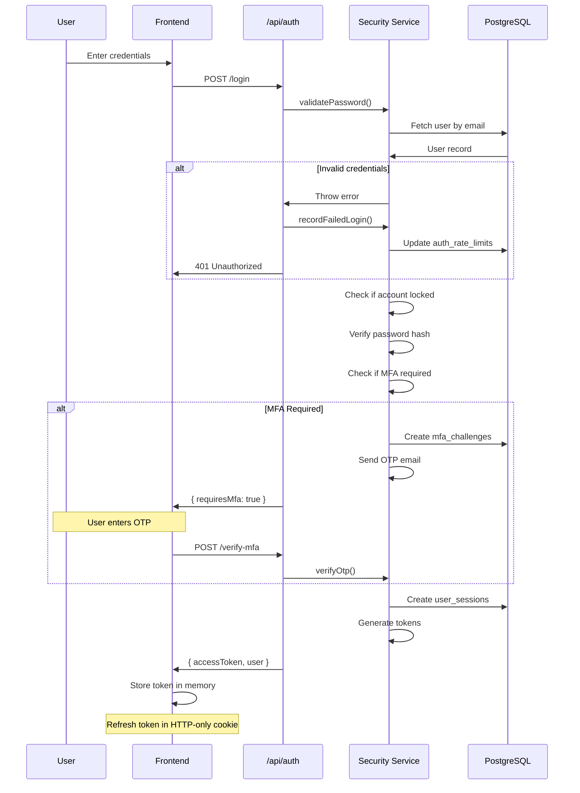
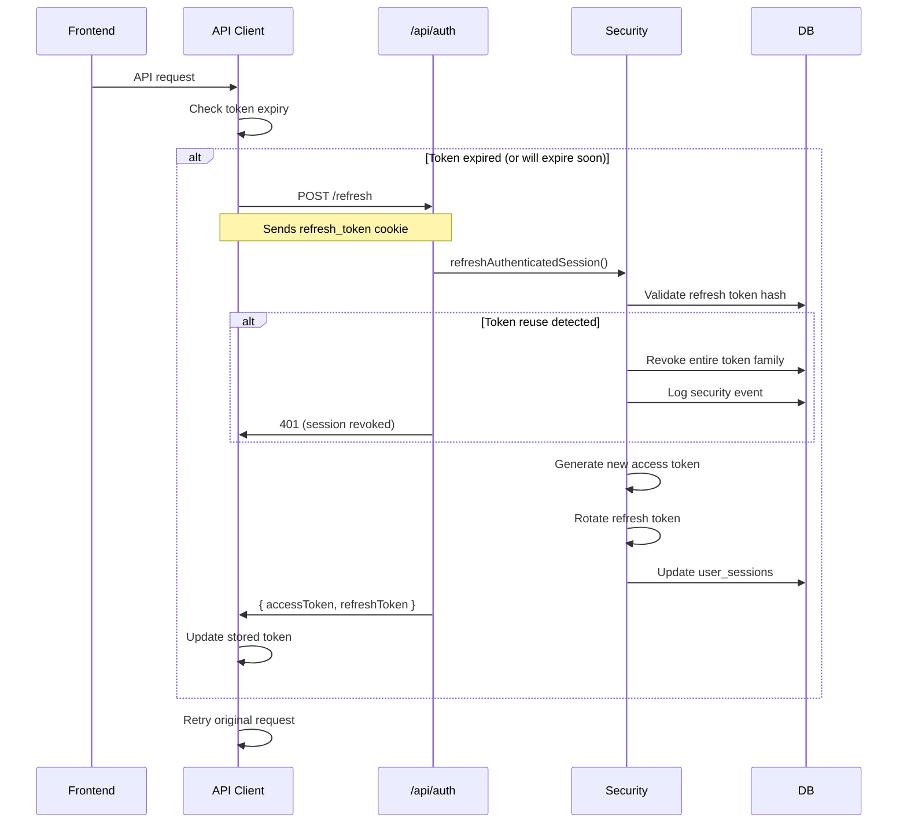
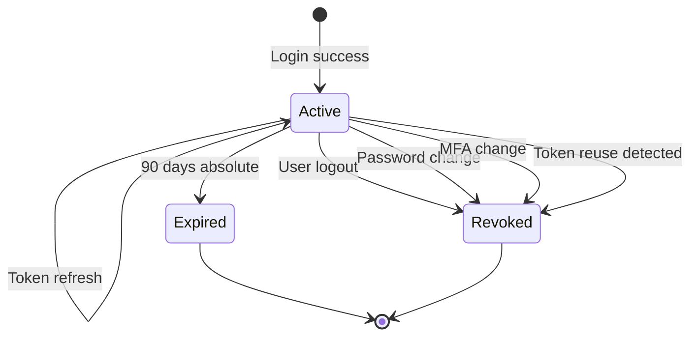
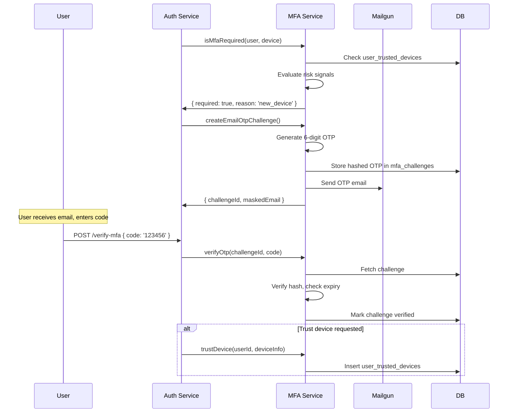
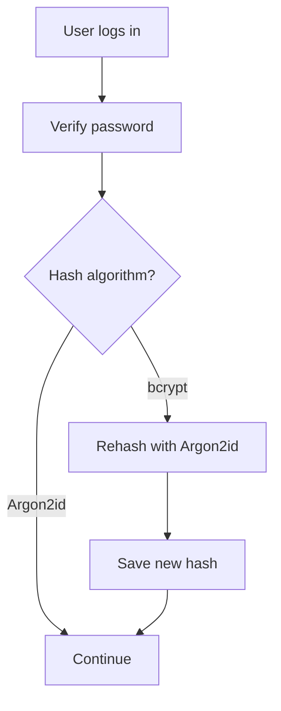
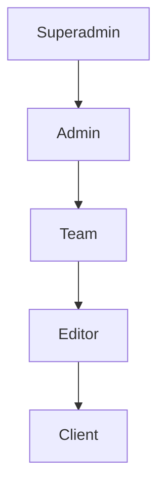
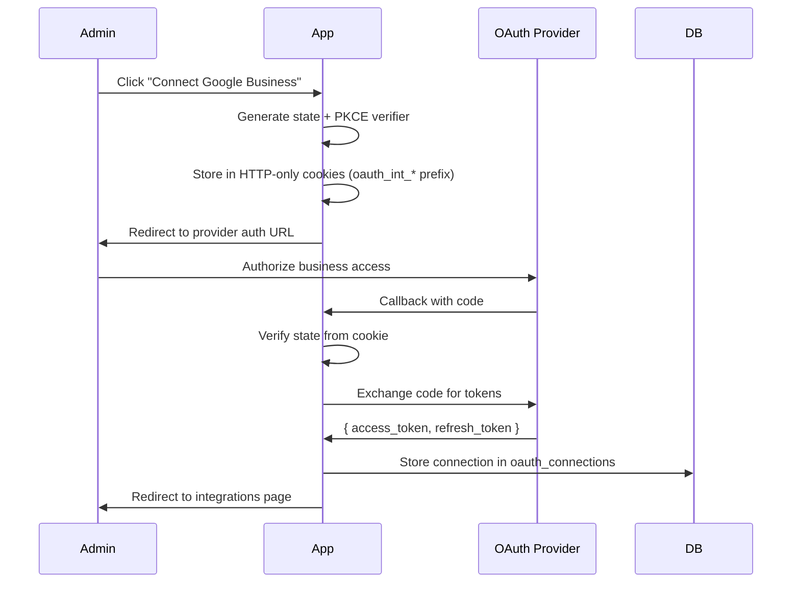

# Security Architecture

> **MAINTENANCE DIRECTIVE**: Update this file when:
> - Authentication flow changes (login, MFA, sessions)
> - Token management logic is modified
> - Password policies change
> - Role-based access control is updated
> - Rate limiting rules change
> - Security headers or CSP policies change
> - Audit logging events are added
> - Files in `server/services/security/` are modified

This document describes the authentication, authorization, and security infrastructure of the Anchor Client Dashboard.

---

## Table of Contents

1. [Overview](#overview)
2. [Authentication Flow](#authentication-flow)
3. [Token Management](#token-management)
4. [Session Management](#session-management)
5. [Multi-Factor Authentication](#multi-factor-authentication)
6. [Password Security](#password-security)
7. [Role-Based Access Control](#role-based-access-control)
8. [Rate Limiting](#rate-limiting)
9. [Security Headers](#security-headers)
10. [Audit Logging](#audit-logging)
11. [OAuth Integration (Business Integrations Only)](#oauth-integration-business-integrations-only)

---

## Overview

The security architecture is designed around these principles:

- **Defense in depth**: Multiple layers of protection
- **Least privilege**: Users get minimum required access
- **Secure by default**: Opt-out security, not opt-in
- **Audit everything**: Comprehensive logging for compliance
- **Zero trust**: Verify every request

### Key Components

| Component | Location | Purpose |
|-----------|----------|---------|
| Token Management | `server/services/security/tokens.js` | JWT creation, validation, rotation |
| Session Management | `server/services/security/sessions.js` | Session lifecycle, device tracking |
| MFA | `server/services/security/mfa.js` | Email OTP, trusted devices |
| Password Policy | `server/services/security/passwordPolicy.js` | Validation, hashing |
| Rate Limiting | `server/services/security/rateLimit.js` | Brute force protection |
| Audit Logging | `server/services/security/audit.js` | Security event logging |
| Device Tracking | `server/services/security/deviceFingerprint.js` | Device identification |

---

## Authentication Flow

### Standard Login Flow



### Token Storage Strategy

| Token Type | Storage | Lifetime | Purpose |
|------------|---------|----------|---------|
| Access Token | Memory (JS variable) | 15 minutes | API authentication |
| Refresh Token | HTTP-only cookie | 30 days sliding | Token renewal |

**Why this approach?**
- Access tokens in memory prevent XSS theft (not in localStorage)
- HTTP-only cookies prevent JavaScript access to refresh tokens
- Short access token lifetime limits exposure window
- Sliding refresh window maintains UX while limiting session lifetime

---

## Token Management

### JWT Structure

**Access Token Claims:**
```json
{
  "sub": "user-uuid",
  "email": "user@example.com",
  "role": "admin",
  "eff": "admin",
  "sid": "session-uuid",
  "iat": 1704067200,
  "exp": 1704068100
}
```

| Claim | Description |
|-------|-------------|
| `sub` | User ID |
| `email` | User email |
| `role` | User's base role |
| `eff` | Effective role (may differ during impersonation) |
| `sid` | Session ID for tracking |
| `iat` | Issued at timestamp |
| `exp` | Expiration timestamp |

### Token Refresh Flow



### Token Family and Reuse Detection

Refresh tokens use a "family" concept:

1. Each refresh token has a `refresh_token_family` UUID
2. When refreshed, a new token is issued with the same family
3. If an old token is reused:
   - Indicates potential token theft
   - Entire family is revoked
   - User must re-authenticate

---

## Session Management

### Session Table (`user_sessions`)

| Column | Description |
|--------|-------------|
| `id` | Session UUID |
| `user_id` | User reference |
| `refresh_token_hash` | SHA-256 hash of refresh token |
| `refresh_token_family` | Token family for reuse detection |
| `device_id` | Stable device identifier |
| `device_fingerprint` | Browser fingerprint hash |
| `device_name` | Human-readable device name |
| `is_trusted` | Device trusted for MFA skip |
| `trusted_until` | Trust expiration (30 days) |
| `ip_address` | Client IP |
| `user_agent` | Browser user agent |
| `country_code` | Geo-located country |
| `city` | Geo-located city |
| `created_at` | Session start |
| `last_activity_at` | Last API activity |
| `absolute_expiry_at` | Hard session limit (90 days) |
| `refresh_expiry_at` | Refresh token expiry (30 days sliding) |
| `revoked_at` | When session was revoked |
| `revoked_reason` | Reason for revocation |

### Session Lifecycle



### Session Revocation Events

| Event | Action |
|-------|--------|
| Logout | Revoke current session |
| Password change | Revoke ALL sessions |
| MFA settings change | Revoke ALL sessions |
| Token reuse detected | Revoke token family |
| Admin action | Revoke specific session |

---

## Multi-Factor Authentication

### MFA Triggers

MFA is **conditionally required** based on risk signals:

| Trigger | Description |
|---------|-------------|
| New device | Device ID not seen before |
| New IP/country | Location change detected |
| Inactivity | No login for 30+ days |
| Untrusted device | Device trust expired or revoked |
| Admin enforcement | `require_mfa_always` flag set |

### MFA Flow



### OTP Configuration

| Setting | Value |
|---------|-------|
| Length | 6 digits |
| Expiry | 10 minutes |
| Max attempts | 5 |
| Algorithm | Random cryptographic |

### Trusted Devices

- Trust period: 30 days
- Identified by device ID + fingerprint
- Can be revoked by user or on security events
- Trust is per-device, not per-session

---

## Password Security

### Password Requirements

| Requirement | Value |
|-------------|-------|
| Minimum length | 12 characters |
| Complexity | No specific requirements (length is primary) |
| Common passwords | Blocked (top 10,000 list) |

### Hashing Algorithm

**Primary: Argon2id**
- Memory cost: 65536 KB
- Time cost: 3 iterations
- Parallelism: 4 threads

**Fallback: bcrypt**
- For legacy passwords
- Auto-upgraded on login

### Hash Upgrade Flow



### Password Change

When password is changed:
1. Validate new password against policy
2. Hash with Argon2id
3. Update `password_hash` and `password_changed_at`
4. Revoke ALL active sessions
5. Log security event

---

## Role-Based Access Control

### Role Hierarchy



### Role Permissions

| Role | Permissions |
|------|-------------|
| `superadmin` | All system access, user management, settings |
| `admin` | Client management, act-as-client, most features |
| `team` | Tasks, forms, limited admin features |
| `editor` | Content editing, read access |
| `client` | Own data only |

### Effective Role

During impersonation, users have an "effective role":
- Admin impersonating client → `effective_role = 'client'`
- Checks use `effective_role` when applicable
- JWT includes both `role` and `eff` (effective) claims

### Middleware Implementation

```javascript
// server/middleware/roles.js

export function isAdmin(req, res, next) {
  const role = req.user?.effective_role || req.user?.role;
  if (role === 'superadmin' || role === 'admin') {
    return next();
  }
  return res.status(403).json({ message: 'Admin access required' });
}

export function isStaff(req, res, next) {
  const role = req.user?.effective_role || req.user?.role;
  if (['superadmin', 'admin', 'team'].includes(role)) {
    return next();
  }
  return res.status(403).json({ message: 'Staff access required' });
}
```

---

## Rate Limiting

### Rate Limit Configuration

| Endpoint | Window | Max Requests |
|----------|--------|--------------|
| Login (per IP) | 15 minutes | 10 attempts |
| Login (per user) | 15 minutes | 5 attempts |
| Password reset | 1 hour | 3 requests |
| General API | 1 minute | 100 requests |

### Account Lockout

| Condition | Lockout Duration |
|-----------|------------------|
| 5 failed logins | 15 minutes |
| 10 failed logins | 1 hour |
| 20 failed logins | 24 hours |

### Rate Limit Table (`auth_rate_limits`)

| Column | Description |
|--------|-------------|
| `limit_key` | Hash of identifier (IP or user) |
| `limit_type` | `login_ip`, `login_user`, `reset_password` |
| `attempts` | Number of attempts |
| `first_attempt_at` | Window start |
| `last_attempt_at` | Most recent attempt |
| `locked_until` | Lockout expiration |

---

## Security Headers

### Helmet Configuration

```javascript
// server/index.js

app.use(helmet({
  contentSecurityPolicy: {
    useDefaults: false,
    directives: {
      'default-src': ["'self'"],
      'script-src': ["'self'", 'https://cdn.jsdelivr.net'],
      'style-src': ["'self'", "'unsafe-inline'", 'https://fonts.googleapis.com'],
      'font-src': ["'self'", 'https://fonts.gstatic.com', 'data:'],
      'img-src': ["'self'", 'data:', 'blob:', ...CSP_IMG_SRC],
      'connect-src': ["'self'", 'https://fonts.googleapis.com'],
      'frame-src': ["'self'", ...CSP_FRAME_SRC]
    }
  }
}));
```

### CSP Exceptions

The Forms Manager route requires relaxed CSP for Monaco Editor:
- `'unsafe-inline'` for scripts
- `'unsafe-eval'` for scripts

This is applied only to `/forms*` routes.

### CORS Configuration

```javascript
const corsOptions = {
  origin: (origin, callback) => {
    if (!origin) return callback(null, true); // Non-browser clients
    if (allowedOrigins.has(origin)) {
      return callback(null, true);
    }
    return callback(new Error('Not allowed by CORS'));
  },
  credentials: true
};
```

---

## Audit Logging

### Security Event Log (`security_audit_log`)

| Column | Description |
|--------|-------------|
| `id` | Event UUID |
| `user_id` | User involved |
| `session_id` | Session if applicable |
| `event_type` | Event type code |
| `event_category` | Event category |
| `ip_address` | Client IP |
| `user_agent` | Browser info |
| `country_code` | Geo-location |
| `device_id` | Device identifier |
| `details` | Event-specific JSONB data |
| `success` | Whether action succeeded |
| `failure_reason` | Reason if failed |
| `created_at` | Event timestamp |

### Event Types

| Category | Events |
|----------|--------|
| `authentication` | `login_success`, `login_failure`, `logout`, `password_change` |
| `mfa` | `mfa_challenge_created`, `mfa_challenge_success`, `mfa_challenge_failure` |
| `session` | `session_created`, `session_refreshed`, `session_revoked`, `token_reuse_detected` |
| `device` | `device_trusted`, `device_trust_revoked` |
| `account` | `password_reset_requested`, `password_reset_completed`, `email_verified` |

### Logging Best Practices

```javascript
// Example: Logging a login attempt
await logSecurityEvent({
  userId: user.id,
  sessionId: session?.id,
  eventType: SecurityEventTypes.LOGIN_SUCCESS,
  eventCategory: SecurityEventCategories.AUTHENTICATION,
  ipAddress: getClientIp(req),
  userAgent: req.headers['user-agent'],
  deviceId: deviceInfo.deviceId,
  details: {
    method: 'password',
    mfa_required: mfaRequired
  },
  success: true
});
```

---

## OAuth Integration (Business Integrations Only)

> **Note**: OAuth is used ONLY for connecting client business accounts to external services (Google Business Profile, Facebook, etc.). User authentication is handled exclusively via username/password + MFA for HIPAA compliance.

### Supported Providers

| Provider | Use Case |
|----------|----------|
| Google | Google Business Profile management |
| Facebook | Business page management |
| Instagram | Business account management |
| TikTok | Business account management |
| WordPress | Blog publishing |

### Integration OAuth Service

OAuth for integrations is handled by `server/services/oauthIntegration.js` with routes in `server/routes/hub.js`.

### Integration OAuth Flow



### OAuth Security Considerations

- Integration tokens are stored separately from user auth
- Tokens are encrypted before storage in `oauth_connections` table
- Refresh tokens are rotated when possible
- Failed refreshes prompt re-authorization
- PKCE (Proof Key for Code Exchange) protects all OAuth flows

---

## Security Checklist

### For Developers

- [ ] Never log sensitive data (passwords, tokens, PII)
- [ ] Use parameterized queries (no string concatenation)
- [ ] Validate all input with Zod schemas
- [ ] Check role/permissions before operations
- [ ] Use HTTPS in production
- [ ] Keep dependencies updated

### For Deployment

- [ ] Set strong `JWT_SECRET` (32+ characters)
- [ ] Configure `CORS_ORIGINS` restrictively
- [ ] Enable `RUN_MIGRATIONS_ON_START` for schema updates
- [ ] Use Cloud SQL with SSL
- [ ] Store secrets in Secret Manager
- [ ] Enable Cloud Run audit logging

### For Compliance

- [ ] Immutable audit logs retained 90+ days
- [ ] Password policy meets standards
- [ ] MFA available for all users
- [ ] Session management prevents hijacking
- [ ] Rate limiting prevents abuse

---

## Related Documentation

- [ARCHITECTURE.md](ARCHITECTURE.md) - System architecture
- [API_REFERENCE.md](API_REFERENCE.md) - API endpoints
- [INTEGRATIONS.md](INTEGRATIONS.md) - Third-party services
- [SKILLS.md](../SKILLS.md) - Database schema reference

---

*Last updated: January 2026*

